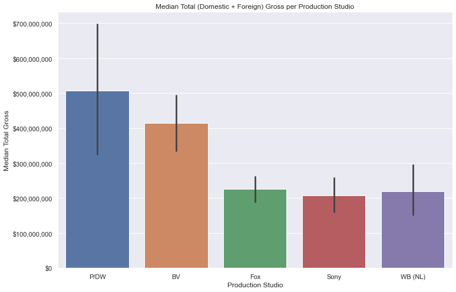

# What Makes a Movie Successful? An  Investigation into Characteristics of High-Grossing Films

**Author**: Sam Oliver

## Overview

The goal of this project is to analyze which qualities of films make them successful. The data used in this project comes from the Box Office Mojo and IMDB, and this analysis combines data from these sources. This analysis compares characteristics such as genre, runtime, and production studio with the total gross to render trends between these characteristics and the financial success of the film. The key findings of this report include the following: films that fit under action and adventure gross well, successful films tend to run between 75-175 minutes, and Pixar/Dreamworks tends to create very successful films on average.

## Business Problem

To reiterate, the main goal of this project is to define which characteristics found in films tend to create successful films. In this analysis, success is measured in light of the total amount the film has grossed. It should be noted that total gross refers to the combined value of both the domestic and foreign gross of the film. This metric is not necessarily the necessary, objective measure of success. For instance, the metric of success could be changed to how well the film is rated. 

This analysis  will import datasets found on Box Office Mojo and IMDB, and then select which categories are the most likely to determine the success of a film. This analysis will then offer visualizations for an understanding of how these categories affect success.

## Data

Box Office Mojo and IMDB have publicly-available datasets about films. This analysis consolidates these datasets into one. This analysis utilizes two datasets from IMDB, and consolidates via an id key used to track individual films. This consolidated dataset is then combined with the Box Office Mojo (BOM) dataset with the title key from the BOM set and the original title key from IMDB. This dataset has 2,447 different films. The target variable in this set is total gross, which is created from adding the domestic and foreign gross columns together for each film. The reason for this combination resonates in the idea that creating a successful film should be treated independently in regard to any particular market location. The other variables analyzed from this dataset include runtime, genre, and studio. These other variables are all other examined in light of how they correlate with total gross.


## Methods

The categories that I will use to compare with total gross will be runtime, genre, and studio. These categories will be used to act as indicators for how they affect the total gross of the film.

The median total (domestic and foreign) gross per genre and studio are evaluated, and runtime is evaluated in regards to total gross. In the genre dataset, there is a problem of dealing with films being categorized in multiple different genres. The subset of the data used for the genre portion of analysis created a data entry for each genre such that each film with an 'n' amount of genres would also have an 'n' amount of data entries- one for each genre.

Each subset relating to the categories highlighted for analysis are then visualized to assist in indicating how they ought to be treated in light of the question of what characteristics are typically found in successful films.

## Results

There are three points to evaluate in consideration of which characteristics of films in the datasets typically correlate with high grossing films: genre, runtime, and studio.

Films in animation, adventure, and sci-fi do much better than other genres. It is recommended that the film studio create animation films based on this data. Below is the visualization for this piece of analysis.


The analysis of runtime shows that films that have a high median total gross (over about five-hundred million dollars) almost always have a runtime between about 75 and 170 minutes. This range is wide, but it is still useful for predicting the success of a film. Below is the visualization for this piece of analysis.


In the analysis of studio and median total gross, Pixar/Dreamworks studio was shown to have the highest gross, by far with a median gross of over five-hundred million dollars per film. It should be noted that there are only ten films in the utilized data subset that were categorized under this studio. It should also be noted that 'BV', the second highest grossing studio in this visualization, refers to Disney. Below is the visualization for this piece of analysis. It is a more conservative approach to partner with Disney, and a riskier endeavour to do so with Pixar/Dreamworks.




## Conclusions

It is highly recommended that films produced by this studio fall under the category of adventure or action and adventure. It is also highly recommended that films have runtime between 75 and 170 minutes because high-grossing films (> $500M) typically have runtimes in this range. There is also a weak, positive relationship between runtime and total gross, so it is recommended that the film studio create films closer to the high end of this range. It may also be useful to contract with some of the higher-grossing studios or do further analysis on how these studios operate to then emulate their practices.

This analysis should not be used as the end-all case for how to proceed with the production of films. This analysis is limited in so far as there may be other (better) indicators for successful movies. For example, a particular actor or director may be a better predictor for film success than the categories analyzed in this project.

## Next Steps

Other variables should be considered for analyzing the success of films. For instance, there may be certain actors or directors who are associated with high-grossing films. Another step for future works is to find the profit for films. In this analysis, the total gross was examined, but it did not account for the expenses involved in producing the film. 


## For More Information

Please review our full analysis in [our Jupyter Notebook](./dsc-phase1-project-template.ipynb) or our [presentation](./DS_Project_Presentation.pdf).


## Repository Structure

```
├── images
├── zippedData
├── student.ipynb
├── phase1pres.pdf
└── README.md                           <- The top-level README for reviewers of this project
```
